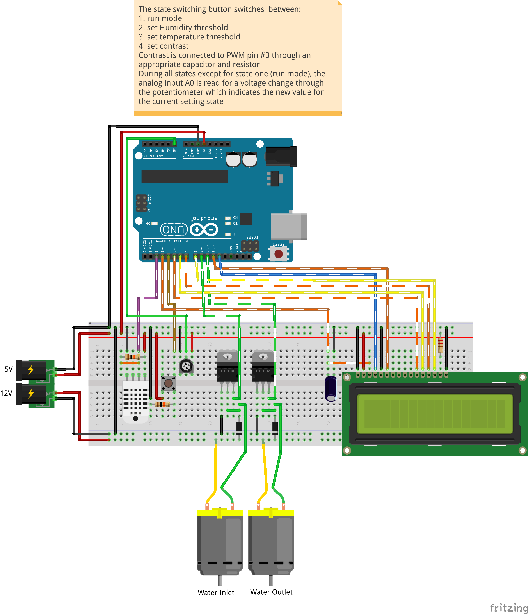

# humidifier
Automatic humidity control through water spraying walves

## Dependencies

- Requires the [adafruit/DHT-sensor-library](https://github.com/adafruit/DHT-sensor-library)  to be linked during compilation of the project. E.g. in Arduino IDE: put `DHT.h` and `DHT.cpp` into a new folder called `DHT`. In the IDE menu import the folder via `Sketch -> Import Library... -> Add Libary...`.
- Hardware wired as depicted below:

    

